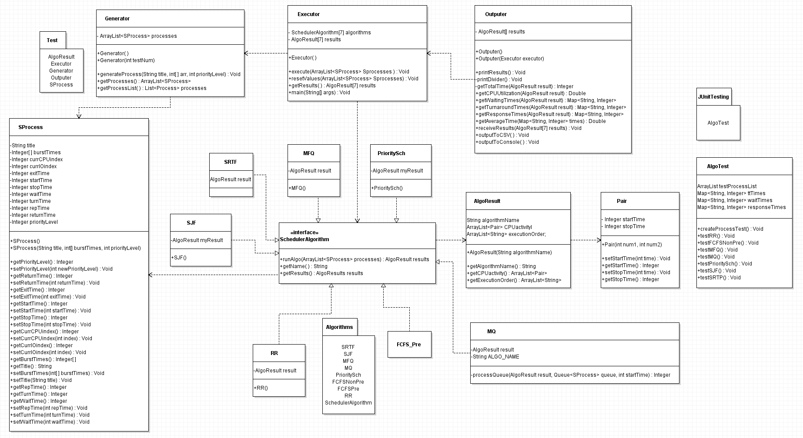
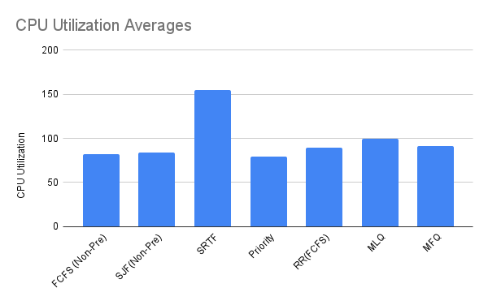
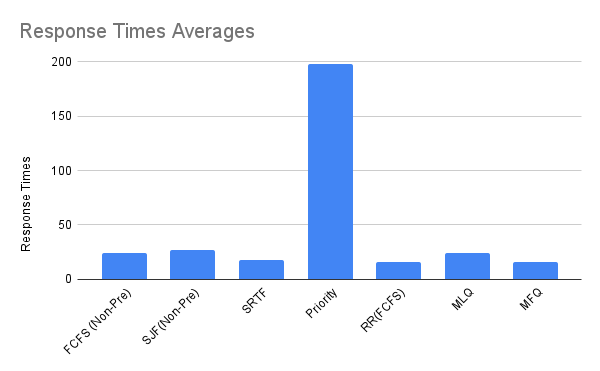

# 
 CPU Scheduler Algorithm Experiment 

## 
 Written by: Jackson Kettel, Kelvin Rajbhandari, Ken Cage, Tamara Slone 

## Table of Contents
### [Introduction](https://github.com/TamS129/CPUScheduler_TeamMetallica/blob/main/Report.md#-introduction-)
* [First Come, First Serve Non-Preemptive](https://github.com/TamS129/CPUScheduler_TeamMetallica/blob/main/Report.md#-first-come-first-serve-fcfs-non-preemptive-)
* [First Come, First Serve Preemptive](https://github.com/TamS129/CPUScheduler_TeamMetallica/blob/main/Report.md#-first-come-first-serve-fcfs-preemptive-)
* [Shortest Job First](https://github.com/TamS129/CPUScheduler_TeamMetallica/blob/main/Report.md#-shortest-job-first-sjf-)
* [Priority Scheduling](https://github.com/TamS129/CPUScheduler_TeamMetallica/blob/main/Report.md#-priority-scheduling-)
* [Round Robin (FCFS)](https://github.com/TamS129/CPUScheduler_TeamMetallica/blob/main/Report.md#-round-robin-with-fcfs-)
* [Multilevel Queue](https://github.com/TamS129/CPUScheduler_TeamMetallica/blob/main/Report.md#-multilevel-queue-mq)
* [Multilevel Feedback Queue](https://github.com/TamS129/CPUScheduler_TeamMetallica/blob/main/Report.md#-multilevel-feedback-queue-mfq-)

### [Project Design (UML)](https://github.com/TamS129/CPUScheduler_TeamMetallica/blob/main/Report.md#-project-design-uml-)
### [Final Results](https://github.com/TamS129/CPUScheduler_TeamMetallica/blob/main/Report.md#-final-results-)
* [Average Result Times](https://github.com/TamS129/CPUScheduler_TeamMetallica/blob/main/Report.md#-average-result-times-)
  * [CPU Utilization](https://github.com/TamS129/CPUScheduler_TeamMetallica/blob/main/Report.md#-cpu-utilization-)
  * [Waiting Times](https://github.com/TamS129/CPUScheduler_TeamMetallica/blob/main/Report.md#-waiting-times-)
  * [Turnaround Times](https://github.com/TamS129/CPUScheduler_TeamMetallica/blob/main/Report.md#-turnaround-times-)
  * [Response Times](https://github.com/TamS129/CPUScheduler_TeamMetallica/blob/main/Report.md#-response-times-)
* [Algorithm Results Times](https://github.com/TamS129/CPUScheduler_TeamMetallica/blob/main/Report.md#-algorithm-result-times-)
### [Conculsion](https://github.com/TamS129/CPUScheduler_TeamMetallica/blob/main/Report.md#-conclusion-)

## 
 Introduction 

&nbsp; &nbsp; &nbsp; &nbsp; CPU scheduling algorithms are essential for optimizing the performance and efficiency of operating systems. These algorithms determine the order in which processes access the CPU, balancing system responsiveness and resource utilization. This report explores several key scheduling algorithms that we have implemented into a Java Project that implements several CPU algorithms that calculate our running times and overall CPU utilization. These algorithms include First-Come, First-Served (FCFS) in both non-preemptive and preemptive forms, Shortest Job First (SJF), Priority Scheduling, Round Robin (RR) with FCFS, Multilevel Queue (MQ), and Multilevel Feedback Queue (MFQ).

&nbsp; &nbsp; &nbsp; &nbsp; This analysis includes the design and overall results of each algorithm (Excluding FCFS Preemptive) and comparing how each algorithm compares in efficiency and runtimes. By examining these algorithms, we gain insights into achieving optimal process management and improving overall system performance. However, before we can start with the results of our algorithms, we must first understand how each algorithm differs and functions.

### 
 First Come, First Serve (FCFS) Non-Preemptive 

<!--- Paragraph about FCFS Non-preemptive Algorithm --->

### 
 First Come, First Serve (FCFS) Preemptive 

&nbsp; &nbsp; &nbsp; &nbsp; In our experiment FCFS preemptive was not implemented into our project. To understand why this algorithm was not implemented, we need to take into consideration what it means for an algorithm to be FCFS and the definition of preemption. We also need to investigate what an FCFS preemptive algorithm would transform into and if there is a possibility of truly creating a FCFS preemptive algorithm.

&nbsp; &nbsp; &nbsp; &nbsp; **First come, first serve (FCFS)** is a scheduling algorithm used in operating systems that takes in a queue of processes and allows the process to release its CPU bursts by order of arrival. FCFS does not have any form of priority intake and thus in its algorithm structure is classified as a non-preemptive algorithm. However, due to its non-preemptive structure, this algorithm can cause issues with interactive systems and lead to potentially longer wait times than other algorithms.  **Preemption** is a form of priority structuring that allows for the algorithm to pause/stop a currently scheduled task and run another process that is higher on the priority list to run first. Preemption allows for the algorithm that implements it to have a quicker response time, allows the operating system to be more reliable, and prevents the processor from being monopolized by one process.

&nbsp; &nbsp; &nbsp; &nbsp; Now with an understanding of FCFS and preemption in mind. Since FCFS algorithm structure is inherently non-preemptive in its implementation. If a priority hierarchy were to be placed into a FCFS algorithm (Ex. A numbering system that labelled each process on a scale of 1 – 10 where 1 is the highest priority.), then it would change the structuring of our FCFS algorithm to a more optimized algorithm. However, in doing this change, we find that the algorithm transforms from a FCFS algorithm to a preemptive [**Priority Scheduling algorithm**](https://github.com/TamS129/CPUScheduler_TeamMetallica/blob/main/Report.md#-priority-scheduling-). The reason for this transformation is that preemptive Priority Scheduling is a special kind of FCFS algorithm and vice versa.

&nbsp; &nbsp; &nbsp; &nbsp; When checking into the similarities between FCFS being implemented with a preemptive priority level and how Priority Scheduling is structured, I cannot help but agree that these two algorithms are closely related. One factor in this change is the way that Priority scheduling takes in the first process by its priority level (which can be numbered) and executes it based on the order, which is very similar to how FCFS takes in the process based on its arrival time executes it. The two algorithms are alike in how they implement their ready queues, with the highest priority or first arrival being at the top of the queue list and the lowest priority or last arrival being at the bottom of the queue. The only differences between these two algorithms being in the complexity of how they are written and the differences in wait times. Therefore, if FCFS were to implement preemptive hierarchies it would transform into a preemptive Priority Scheduling algorithm.

### 
 Shortest Job First (SJF) 

The **Shortest Job First (SJF)** scheduling algorithm is a non-preemptive scheduling strategy that selects the process with the smallest CPU burst time for execution next. This approach aims to minimize the average waiting time for processes in the ready queue, thereby improving overall system efficiency.

**However**, the SJF algorithm cannot be implemented at the level of CPU Scheduling because it's impossible to know the burst times of a process beforehand. Therefore in SJF, each process is assigned an estimated burst time approximated as ab exponential average of measure lengths of previous CPU bursts. The scheduler then picks the process with the shortest burst time and executes it until the burst time is over. Then if processes have I/O bursts as well, the process is sent to an I/O wait queue where it has to wait out the duration of it's I/O burst before it can join the ready queue. This cycle is repeated for the remaining processes until they're all fully completed.

One of the key advantages of SJF is its ability to significantly reduce the average turnaround time and waiting time, making it an optimal choice for batch processing systems where processes are executed in a batch without requiring user interaction. The major drawback of SJF, as mentioned above, is the difficulty in accurately estimating the burst time, which can lead to suboptimal scheduling decisions if the estimates are incorrect. Additionally, SJF can suffer from the "starvation" problem, where longer processes may be delayed indefinitely if short processes continue to arrive. To mitigate this issue, a variation known as Shortest Remaining Time First (SRTF) can be used, where the process with the smallest remaining execution time is selected, providing a more dynamic and responsive scheduling approach.

### 
 Priority Scheduling 

The **Priority Scheduling** Algorithm is a versatile and widely used scheduling algorithm where each process is assigned a priority level, and the CPU is allocated to the process with the highest priority. This algorithm is naturally preemptive as if a new process arrives with a higher priority than the currently running process, the CPU is preempted and reassigned to the new process, ensuring that high-priority tasks are executed promptly.

Priority Scheduling is particularly useful in real-time systems where certain tasks must be prioritized over others to meet critical deadlines, such as in embedded systems or operating systems with strict timing requirements. One of its primary advantages is the flexibility it offers in managing different types of processes with varying levels of importance, allowing for more effective resource allocation.

The major drawback of Priority Scheduling is that the algorithm can lead to the issue of "starvation," where low-priority processes may never get executed if higher priority processes continue to arrive. To mitigate this, aging techniques can be implemented, where the priority of a process increases the longer it waits, ensuring that all processes eventually receive CPU time. This approach balances the needs of both high-priority and low-priority processes, enhancing overall system performance and responsiveness.

### 
 Round Robin (with FCFS) 

Within our CPU Scheduler experiment, one of the algorithms that was added into our project is Round Robin with FCFS implementation. **Round Robin (RR)** is a commonly used scheduling algorithm that uses **time slicing** (or time quantum’s) to assign a fixed unit of time for every process. Round Robn ensures that no single process can monopolize the CPU, as each process gets a fair share of CPU time in a cyclic manner. If a process’s burst time exceeds the time quantum, it is preempted and moved to the end of the queue, allowing the next process to use the CPU. This continues until all processes are completed. This algorithm can make sure all processes get a fair share of CPU time and is easy to implement. However, it can suffer from high context-switching overhead if the time quantum is too small. Round Robin may also degrade to a First-Come, First-Served (FCFS) behavior if the time quantum is too large. (More information on FCFS can be found [here](https://github.com/TamS129/CPUScheduler_TeamMetallica/blob/main/Report.md#-first-come-first-serve-fcfs-preemptive-).) This can lead to inefficiencies like the "convoy effect" where short processes wait behind long ones. Which in turn makes choosing a time quantum for implementing this algorithm important

In our Round Robin (with FCFS) algorithm, we have implemented a time quantum of 5 for every process. Meaning that every for every 5 units of CPU burst time the process must stop and return into a ready queue. Once the process is transferred to the ready queue, the next process is called and releases a CPU burst for 5 units. If the process has a shorter burst time than our quantum time, the process will complete its burst and go into I/O time. Because we are implementing Round Robin with FCFS the order of the processes sent will be determined based on the arrival time. However, since we are assuming that all arrival times in our processes start at 0, the processes are implemented one at a time from P1 to P8.

### 
 Multilevel Queue (MQ)

<!--- Paragraph about SJF MQ Algorithm --->

### 
 Multilevel Feedback Queue (MFQ) 

<!--- Paragraph about SJF MFQ Algorithm --->

## 
 Project Design (UML) 

;

## 
 Final Results 

## 
 Average Result Times 

|                     | FCFS (Non-Pre) | FCFS (Pre) | SJF(Non-Pre)  | SRTF | Priority | RR(FCFS) | MLQ | MLFQ |
|:--------------------|:--------------:|:----------:|:-------------:|:----:|:--------:|:--------:|:---:|:----:|
| CPU utilization     |                |    N/A     |               |      |          |          |     |      |
| Avg Waiting time    |                |    N/A     |               |      |          |          |     |      |
| Avg Turnaround Time |                |    N/A     |               |      |          |          |     |      |
| Avg Response Time   |                |    N/A     |               |      |          |          |     |      |
### 
 CPU Utilization 

<!--- Insert Dicussion of CPU Utilization--->

### 
 Waiting Times 

<!--- Insert Dicussion of WT--->

### 
 Turnaround Times 

<!--- Insert Dicussion of TT--->

### 
 Response Times 

<!--- Insert Table--->
<!--- Insert Dicussion of RT--->

## 
 Algorithm Result Times 

| SJF  CPU Utilization:            |               |                  |                |    | FCFS (Non-Pre) CPU Utilization:      |                      |                  |                |    | Priority Schdueling CPU Utilization:   |           |                  |                |                |    |
|:---------------------------------|:-------------:|:----------------:|:--------------:|:--:|:------------------------------------:|:--------------------:|:----------------:|:--------------:|:--:|:---------------------------------------|-----------|:----------------:|:--------------:|:--------------:|:--:|
|                                  | Waiting Times | Turnaround Times | Response Times |    |                                      |    Waiting Times     | Turnaround Times | Response Times |    |                                        | Wait Time | TurnAround Times | Response Times |                |    |
|                                  |               |                  |                |    |                                      |                      |                  |                |    |                                        |           |                  |                |                |    |
| P1                               |       217     |       247        |      11        |    | P1                                   |          405         |       439        |      0         |    | P1                                     |     230   |       260        |      27        |                |    | 
| P2                               |       367     |       424        |       3        |    | P2                                   |          507         |       572        |      5         |    | P2                                     |     720   |       777        |     401        |                |    |
| P3                               |       512     |       602        |      16        |    | P3                                   |          467         |       563        |      9         |    | P3                                     |     332   |       452        |     231        |                |    |
| P4                               |       408     |       443        |       0        |    | P4                                   |          633         |       671        |      17        |    | P4                                     |     249   |       319        |      32        |                |    |
| P5                               |       448     |       542        |     109        |    | P5                                   |          446         |       544        |      20        |    | P5                                     |     200   |       294        |      0         |                |    |
| P6                               |       210     |       279        |      24        |    | P6                                   |          395         |       472        |      36        |    | P6                                     |     158   |       227        |      16        |                |    | 
| P7                               |       333     |       417        |      47        |    | P7                                   |          420         |       514        |      47        |    | P7                                     |     564   |       680        |      469       |                |    |
| P8                               |       275     |       320        |       7        |    | P8                                   |          447         |       498        |      61        |    | P8                                     |     564   |       625        |      405       |                |    |

| RR (FCFS)  CPU Utilization: |               |                  |                |    |    | MQ CPU Utilization: |                  |                      |    |    | MFQ CPU Utilization: |                  |                |                |    |
|:----------------------------|:-------------:|:----------------:|:--------------:|:--:|:--:|:-------------------:|:----------------:|:--------------------:|:--:|:---|----------------------|:----------------:|:--------------:|:--------------:|:--:|
|                             | Waiting Times | Turnaround Times | Response Times |    |    |    Waiting Times    | Turnaround Times |    Response Times    |    |    | Wait Time            | TurnAround Times | Response Times |                |    |
| P1                          |     300       |      334         |      0         |    |    |                     |                  |                      |    |    |                      |                  |                |                |    |
| P2                          |     513       |      578         |      5         |    | P1 |         0           |       5          |         0            |    | P1 |        259           |       293        |      0         |                |    | 
| P3                          |     474       |      570         |      9         |    | P2 |         5           |       9          |         5            |    | P2 |        460           |       525        |      5         |                |    |
| P4                          |     400       |      438         |      14        |    | P3 |         9           |       17         |         9            |    | P3 |        503           |       599        |      9         |                |    |
| P5                          |     465       |      563         |      17        |    | P4 |         17          |       20         |         17           |    | P4 |        517           |       555        |      14        |                |    |
| P6                          |     408       |      485         |      22        |    | P5 |         20          |       36         |         20           |    | P5 |        510           |       608        |      17        |                |    |
| P7                          |     526       |      620         |      27        |    | P6 |         36          |       47         |         36           |    | P6 |        345           |       422        |      22        |                |    | 
| P8                          |     258       |      309         |      32        |    | P7 |         47          |       61         |         47           |    | P7 |        504           |       598        |      27        |                |    |
|                             |               |                  |                |    | P8 |         61          |       65         |         61           |    | P8 |        471           |       522        |      32        |                |    |

| SRTF CPU Utilization:            |               |                  |                |    |
|:---------------------------------|:-------------:|:----------------:|:--------------:|:--:|
|                                  | Waiting Times | Turnaround Times | Response Times |    |
| P1                               |      202      |       236        |      11        |    | 
| P2                               |      365      |       430        |      3         |    |
| P3                               |      312      |       408        |      16        |    |
| P4                               |      446      |       484        |      0         |    |
| P5                               |      260      |       358        |      49        |    |
| P6                               |      162      |       239        |      24        |    |
| P7                               |      269      |       363        |      35        |    |
| P8                               |      265      |       316        |      7         |    |

## 
 Conclusion 
  
 
## Attributes
Tamara - Generator, SProcess, RR, FCFS-preemptive report, AlgoTest  
Jackson - Outputer, FCFSNonPre, MFQ  
Ken - SRTF, MLQ  
Kelvin - Executor, SchedulerAlgorithm interface, SJF, PrioritySch  

Tamara, Kelvin - AlgoResult, Pair
